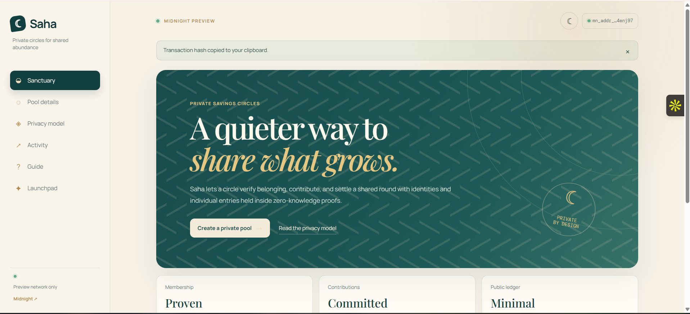
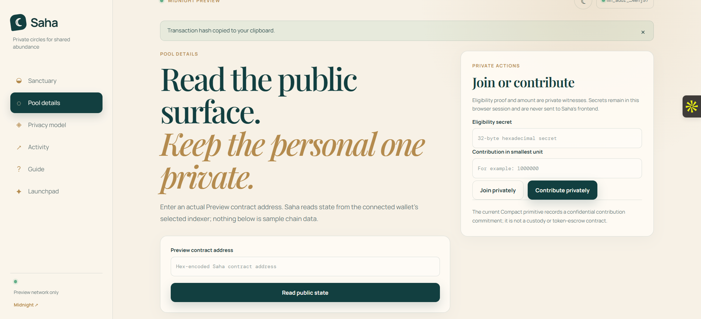
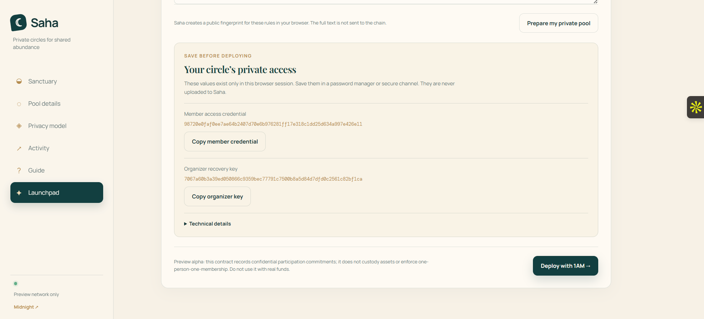
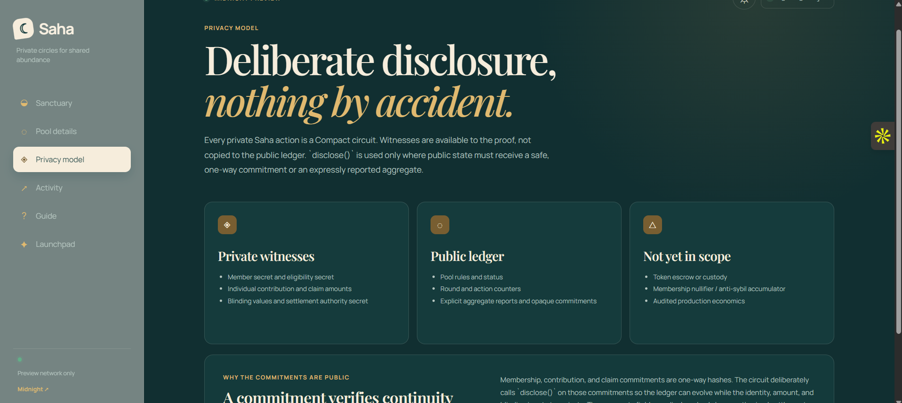
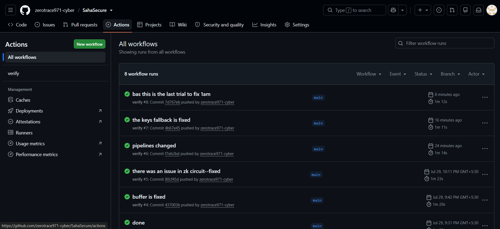

# Saha — Midnight private savings circles

Saha is a Preview-only Midnight dApp for private savings circles and confidential profit-sharing pool records. It is intentionally not a voting app, does not fabricate chain data, and keeps its visual language calm: ivory, sand, deep teal, muted gold, tile geometry, and moon motifs.

**Live website:** [saha-secure.vercel.app](https://saha-secure.vercel.app/)

> **Alpha / no real funds.** Saha currently provides a privacy-preserving membership and contribution-record primitive. It does **not** custody tokens, transfer funds, enforce one-person-one-membership, or implement audited settlement economics. Do not use it with real value.

## What is real

- [`contracts/SahaPool.compact`](contracts/SahaPool.compact) is a Compact 0.23 contract compiled with the official Compact CLI. Its generated JS, ZKIR, prover keys, and verifier keys live in [`contracts/managed/saha`](contracts/managed/saha).
- It uses private witnesses for member, eligibility, authority, amount, and blinding inputs. `disclose()` is deliberate: only public constructor values, opaque commitments, and authorized pool-wide aggregates are written to the ledger.
- The frontend detects DApp Connector **v4** wallets injected at `window.midnight`, connects to `preview`, gets a wallet proving provider, proves locally/delegated through the wallet, calls `balanceUnsealedTransaction`, then calls `submitTransaction`.
- `public/zk/saha-v2` is generated from `managed/` before every production build. Vite/Vercel serve the `.bzkir`, prover, and verifier artifacts as static files; no prover, signing key, wallet key, or API key runs on a server.
- There is a working interaction path: derive a private eligibility credential commitment, deploy, then join or submit a confidential contribution against an actual Preview contract address.

## Website Screenshots

### Sanctuary dashboard



### Pool details and private actions



### Browser-only pool launchpad



### Privacy model, dark theme



### Working CI/CD pipeline



## Architecture

```text
Browser + 1AM wallet
  ├─ DApp Connector v4: connect Preview, proving, fee balancing, submission
  ├─ Static /zk/saha-v2 artifacts: ZKIR + proving/verifier keys
  └─ Wallet-selected Preview indexer: public contract state + cost model
                         │
                         ▼
                Midnight Preview ledger
                status, rules, counters,
                aggregates, opaque commitments
```

The Vercel deployment contains only the frontend. Browser-to-wallet calls and Preview indexer reads happen from the user’s device.

## Contract privacy boundary

| Private witness data | Deliberately public ledger data |
| --- | --- |
| Member and eligibility secrets | Pool status and round counters |
| Individual contribution / claim amount | Rules, eligibility, and authority commitments |
| Blinding values | Action counts and opaque latest commitments |
| Settlement authority secret | Authorized pool-wide aggregates |

The eligibility proof is knowledge of a secret whose Compact `persistentHash` commitment was published at deployment. The settlement authority uses the same secret-knowledge construction. This avoids accepting a caller-controlled `true` boolean as a proof. Read [`PRIVACY_MODEL.md`](PRIVACY_MODEL.md) before using the prototype.

## Local setup

Requirements:

- Node.js 22+
- npm 11+
- Official Compact CLI 0.31.1 toolchain. Windows users need WSL; see Midnight’s Compact installation documentation.

```bash
npm ci
npm run contract:compile
npm run dev
```

On Windows, the scripts invoke the configured WSL distribution (default `Ubuntu-20.04`). Override it when needed:

```powershell
$env:MIDNIGHT_WSL_DISTRO = 'Ubuntu'
npm run contract:compile
```

The compiler output is intentionally retained in `contracts/managed/saha`. Do not hand-edit it.

## Verify before deployment

```bash
npm run contract:format:check
npm run contract:compile
npm test
npm run typecheck
npm run build
```

`npm run build` runs `contract:sync` and copies `keys/` and `zkir/` from `managed/` to `public/zk/saha-v2`. That versioned path prevents a browser from reusing a stale verifier-key response from a previous deployment.

`vercel.json` deliberately does **not** include a catch-all SPA rewrite: Saha uses hash navigation, and a catch-all rewrite would return `index.html` for `/zk/saha-v2/...` instead of the binary proving and verifier files.

Vercel is explicitly configured to run `npm run build` and publish `dist/`; this executes the artifact-sync step. A complete deployment serves files such as `/zk/saha-v2/keys/joinPool.verifier` and `/zk/saha-v2/zkir/joinPool.bzkir` directly from the frontend origin.

## Preview flow

1. Install and unlock a 1AM wallet supporting Midnight DApp Connector v4, then select **Preview**.
2. Open the app. Saha shows an actual injected wallet only; it never simulates a connection or balance.
3. In **Create a private pool**, enter a pool name and the agreement in plain language, then select **Prepare my private pool**. The browser creates the public rules fingerprint, member credential, and organizer recovery key locally. Save the two private values before continuing.
4. Click **Deploy with 1AM**. The dApp asks the wallet for `getProvingProvider`, proves with the static artifact provider, calls `balanceUnsealedTransaction`, and submits with `submitTransaction`.
5. Once accepted, the app displays the actual contract address and the exact transaction hash returned by the balanced deployment transaction. Wait for the wallet/network confirmation before sharing the address.
6. In **Pool details**, supply the displayed contract address and a valid private member credential. Join privately or submit a positive integer confidential contribution in the token’s smallest unit.

Saha derives a transaction hash in the browser from the exact sealed transaction returned by the wallet's `balanceUnsealedTransaction` call, then submits those same bytes with `submitTransaction`. It never invents a hash. Use the wallet history to check finalisation status.

The settlement-authority secret also deterministically derives the Compact maintenance signing key using a domain-separated SHA-256 seed inside the browser. This prevents the deployment builder from silently generating and losing a maintenance key. Protect that authority secret accordingly.

## Contract semantics

`SahaPool` has circuits for:

- `joinPool`
- `contributeConfidentially`
- `claimConfidentially`
- `beginSettlement`
- `publishRoundAggregates`
- `openNextRound`
- `closePool`

The present UI wires `joinPool` and `contributeConfidentially`. The remaining authority circuits are compiled and available to a future organizer interface. The current contract keeps the latest opaque commitment and public counters; a production pool needs a reviewed append-only accumulator/nullifier design before it can claim duplicate-prevention.

## Deployment

See [`DEPLOYMENT.md`](DEPLOYMENT.md) for Vercel instructions and CSP/cache guidance. The deployment needs no environment variables and must not accept wallet or API secrets as Vercel settings.

### Recorded Midnight Preview deployment

| Field | Value |
| --- | --- |
| Contract address | `567619712098bc97e42831c57d9e5d6af7a4dee781b7b5c5df4103b9307b34d8` |
| Deployment transaction hash | `28dccda2b4ab168236634555e16b617f1da9847a607a6c1f2fc4be91d51ebe7b` |

Use the transaction hash in 1AM wallet history or a Midnight Preview explorer to verify its current finalisation status before relying on the deployment.

## Tests and CI

The tests validate strict secret parsing plus the generated Compact pure circuits and their domain-separated commitment behaviour. GitHub Actions runs formatter, official compiler, tests, typecheck, and a production build on every push and pull request.

## Security notes

- Never paste live eligibility or authority secrets into issues, chat, `.env`, or a shared browser profile.
- A user who knows the shared eligibility secret can satisfy the current eligibility proof. This alpha contract has no per-member nullifier or credential revocation.
- An amount is private to the circuit, but Saha does not yet prove ownership or move a corresponding token amount. Integrate a reviewed shielded-token escrow before using economic language beyond confidential records.
- Wallets and browser extensions are untrusted UI sources; Saha displays wallet names as text and only renders HTTPS or `data:image/` wallet icons.
